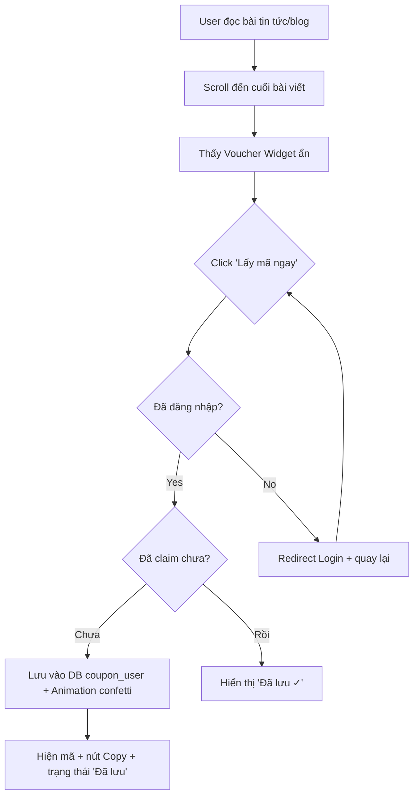

# Hidden Voucher trong Trang Tin Tức / Blog

> **Goal**: User vào trang Tin tức / Blog / Event → phát hiện mã giảm giá ẩn → click "Lấy mã" → lưu vào tài khoản → dùng khi checkout.

---

## 🧠 Brainstorm: 3 Phương Án

### Option A: Shortcode trong CKEditor Content
Admin chèn `[voucher:SUMMER20]` vào nội dung bài viết → hệ thống parse shortcode → render thành nút "Lấy mã" khi hiển thị.

✅ **Pros:**
- Linh hoạt — voucher ở BẤT KỲ vị trí nào trong bài
- Gamification tốt — user phải đọc bài mới tìm thấy

❌ **Cons:**
- Admin phải nhớ syntax shortcode
- Khó validate coupon code khi nhập (typo)
- CKEditor có thể escape ký tự `[` `]`

📊 **Effort:** Medium

---

### Option B: Gắn Coupon vào Post qua Relation (🏆 Đề xuất)
Admin chọn coupon từ **dropdown** khi tạo/sửa bài viết → hệ thống tự render widget voucher đẹp **cuối bài viết**.

✅ **Pros:**
- UX admin rõ ràng — chọn từ danh sách, không cần nhớ code
- Dễ validate, dễ quản lý (biết bài nào gắn mã nào)
- Widget design đẹp, thống nhất
- Có thể kết hợp "ẩn" bằng cách user phải scroll xuống cuối mới thấy

❌ **Cons:**
- Ít linh hoạt hơn Option A về vị trí hiển thị
- Mỗi bài chỉ gắn 1-2 mã (đủ cho use case)

📊 **Effort:** Low-Medium

---

### Option C: Gamification "Egg Hunt"
Voucher ẩn dưới dạng icon/badge ẩn trong bài viết (fade, opaque nhỏ). User phải hover/tap để "phát hiện" → hiện popup claim.

✅ **Pros:**
- Trải nghiệm thú vị, tăng engagement
- Tạo cảm giác "săn mã"

❌ **Cons:**
- Effort cao — cần CSS animation phức tạp
- Mobile UX khó (không có hover)
- User có thể frustrate nếu không tìm thấy

📊 **Effort:** High

---

## 💡 Recommendation

**Option B** — Gắn coupon vào Post qua Relation. Lý do:
1. **Admin-friendly** — không cần nhớ shortcode, chọn từ dropdown
2. **Effort thấp** — tận dụng coupons table đã có
3. **Kiểm soát tốt** — admin biết bài nào gắn mã nào
4. **"Hidden" element** — widget hiển thị ở phần cuối bài, user phải scroll đọc bài mới thấy → vẫn tạo cảm giác "khám phá"
5. **Design premium** — widget dạng "scratch card" hoặc "reveal" animation

---

## Proposed Changes

### Quy trình User Flow



---

### Component 1: Database

#### [NEW] Migration: `create_coupon_user_table`

| Column | Type | Description |
|--------|------|-------------|
| `id` | bigint PK | Auto increment |
| `coupon_id` | FK → coupons.id | Mã giảm giá được claim |
| `user_id` | FK → users.id | User đã claim |
| `claimed_at` | timestamp | Thời điểm claim |
| `source` | string | Nguồn claim: `'news'`, `'blog'`, `'event'` |
| `source_id` | nullable FK → posts.id | Bài viết chứa voucher |
| UNIQUE | `(coupon_id, user_id)` | Mỗi user chỉ claim 1 lần / coupon |

#### [NEW] Migration: `add_coupon_id_to_posts_table`

| Column | Type | Description |
|--------|------|-------------|
| `coupon_id` | nullable FK → coupons.id | Mỗi bài gắn 1 mã giảm giá |

> [!NOTE]
> Dùng pivot table `coupon_user` thay vì `coupons.user_id` hiện tại (vốn dùng cho coupon riêng tặng user cụ thể). Đây là "claim history" — nhiều user claim cùng 1 mã.

---

### Component 2: Models

#### [MODIFY] [Post.php](file:///c:/laragon/www/du-an-tot-nghiep-7ae-Sieu-Nhan-Gao/app/Models/Post.php)
- Thêm `coupon_id` vào `$fillable`
- Thêm relationship `coupon()` → `belongsTo(Coupon::class)`

#### [MODIFY] [Coupon.php](file:///c:/laragon/www/du-an-tot-nghiep-7ae-Sieu-Nhan-Gao/app/Models/Coupon.php)
- Thêm relationship `claimedByUsers()` → `belongsToMany(User::class, 'coupon_user')->withPivot('claimed_at', 'source', 'source_id')`
- Thêm relationship `posts()` → `hasMany(Post::class)`
- Thêm method `isClaimedBy(User $user): bool`
- Thêm method `remainingClaims(): ?int` (nếu có usage_limit)

#### [MODIFY] User.php
- Thêm relationship `claimedCoupons()` → `belongsToMany(Coupon::class, 'coupon_user')->withPivot('claimed_at', 'source', 'source_id')`

---

### Component 3: Backend Controllers

#### [NEW] `VoucherClaimController.php` (Frontend)

```php
// POST /voucher/claim (AJAX)
public function claim(Request $request)
{
    // 1. Validate: coupon_id (required), source, source_id
    // 2. Check user authenticated (middleware)
    // 3. Check coupon exists + valid (active, dates, usage_limit)
    // 4. Check user chưa claim (unique constraint in DB)
    // 5. Insert coupon_user record
    // 6. Increment coupon used_count
    // 7. Return JSON { success: true, coupon_code, message }
}
```

#### [MODIFY] [HomeController.php](file:///c:/laragon/www/du-an-tot-nghiep-7ae-Sieu-Nhan-Gao/app/Http/Controllers/Frontend/HomeController.php)
- `newsDetail()`: Eager load `$post->coupon`
- Truyền `$hasClaimed` (bool) nếu user đã login + đã claim coupon này

#### [MODIFY] [AccountController.php](file:///c:/laragon/www/du-an-tot-nghiep-7ae-Sieu-Nhan-Gao/app/Http/Controllers/Frontend/AccountController.php)
- `index()`: Merge `claimedCoupons` vào query coupons hiện tại → user thấy cả mã tặng riêng + mã đã claim từ bài viết

---

### Component 4: Routes

#### [MODIFY] [web.php](file:///c:/laragon/www/du-an-tot-nghiep-7ae-Sieu-Nhan-Gao/routes/web.php)

```php
// Trong group auth middleware
Route::post('/voucher/claim', [VoucherClaimController::class, 'claim'])->name('voucher.claim');
```

---

### Component 5: Frontend Views

#### [MODIFY] [news_detail.blade.php](file:///c:/laragon/www/du-an-tot-nghiep-7ae-Sieu-Nhan-Gao/resources/views/frontend/news_detail.blade.php)

Thêm **Voucher Widget** sau nội dung bài viết, chỉ hiển thị khi `$post->coupon` tồn tại:

**Trạng thái 1 — Chưa claim (blur reveal):**
```
┌─────────────────────────────────────────────┐
│  🎁 ƯU ĐÃI ĐẶC BIỆT DÀNH CHO BẠN         │
│                                             │
│  ┌─────────────────────────────────────┐   │
│  │  ███████████  ← overlay blur        │   │
│  │  Giảm 20% cho đơn từ 500K          │   │
│  │                                     │   │
│  │  [🎉 Khám phá mã giảm giá]         │   │
│  └─────────────────────────────────────┘   │
│                                             │
│  HSD: 30/04/2026 • Còn 45 lượt              │
└─────────────────────────────────────────────┘
```

**Trạng thái 2 — Đã claim:**
```
┌─────────────────────────────────────────────┐
│  🎉 BẠN ĐÃ NHẬN MÃ THÀNH CÔNG!            │
│                                             │
│  ┌─────────────────────────────────────┐   │
│  │  SUMMER20              [📋 Copy]    │   │
│  │  Giảm 20% cho đơn từ 500K          │   │
│  │  ✓ Đã lưu vào tài khoản            │   │
│  └─────────────────────────────────────┘   │
│                                             │
│  Dùng tại Giỏ hàng hoặc Checkout            │
└─────────────────────────────────────────────┘
```

**UI Features:**
- Dạng dashed-border card (đồng bộ với coupon card trong tài khoản)
- Background gradient subtle
- Animation: Confetti nhẹ khi claim thành công
- Voucher code có blur filter → reveal khi click
- Nút "Copy mã" sau khi reveal
- AJAX call — không reload trang

#### [MODIFY] [news.blade.php](file:///c:/laragon/www/du-an-tot-nghiep-7ae-Sieu-Nhan-Gao/resources/views/frontend/news.blade.php)

Thêm **badge "🎁 Có ưu đãi"** trên card bài viết có `coupon_id` → thu hút user click vào.

---

### Component 6: Admin — Gắn Voucher vào Post

#### [MODIFY] Admin Post Create/Edit Views

Thêm **dropdown select** chọn coupon (nullable):

```html
<label>Gắn mã giảm giá ẩn (Hidden Voucher)</label>
<select name="coupon_id" class="form-select">
    <option value="">-- Không gắn mã --</option>
    @foreach($activeCoupons as $coupon)
        <option value="{{ $coupon->id }}">
            {{ $coupon->code }} — {{ $coupon->getFormattedValue() }}
            (HSD: {{ $coupon->end_date?->format('d/m/Y') ?? 'Không giới hạn' }})
        </option>
    @endforeach
</select>
```

#### [MODIFY] [PostController.php](file:///c:/laragon/www/du-an-tot-nghiep-7ae-Sieu-Nhan-Gao/app/Http/Controllers/Admin/PostController.php)
- `create()` / `edit()`: Truyền `$activeCoupons` vào view
- `store()` / `update()`: Lưu `coupon_id` vào Post
- Validate: `coupon_id` nullable, exists in coupons table

---

## User Review Required

> [!IMPORTANT]
> **Quyết định 1**: Mỗi Post gắn **tối đa 1 coupon** hay **nhiều coupon**? Plan hiện tại dùng `coupon_id` trên posts table (1 post = 1 coupon). Nếu cần nhiều → dùng pivot table `coupon_post`.

> [!IMPORTANT]
> **Quyết định 2**: Guest user thấy widget voucher nhưng khi click sẽ **redirect login** rồi quay lại? Hay **ẩn hoàn toàn** widget với guest?

> [!WARNING]
> **Quyết định 3**: Khi coupon hết lượt (`used_count >= usage_limit`), widget hiển thị **"Hết mã"** hay **ẩn luôn**?

---

## Open Questions

1. Voucher widget hiện ở **cuối bài viết** (phải scroll) hay **giữa bài** (dễ thấy hơn)?
2. Cần **hiệu ứng reveal** (blur → clear khi click) hay hiển thị thẳng nút "Lấy mã"?
3. Admin có cần xem **thống kê claim** (bao nhiêu user claim từ bài nào) không?

---

## Task Breakdown

| # | Task | Files | Effort |
|---|------|-------|--------|
| 1 | Tạo 2 migration (`coupon_user` + `add_coupon_id_to_posts`) | 2 files | Low |
| 2 | Update Models (Post, Coupon, User) | 3 files | Low |
| 3 | Tạo `VoucherClaimController` + route | 2 files | Medium |
| 4 | Update `HomeController::newsDetail` + `news()` | 1 file | Low |
| 5 | Design & implement Voucher Widget (`news_detail.blade.php`) | 1 view + CSS/JS | Medium-High |
| 6 | Thêm badge "Có ưu đãi" trên news card | 1 view | Low |
| 7 | Update Admin Post form (dropdown coupon) | 2 views + controller | Medium |
| 8 | Update Account coupons tab (merge claimed) | 1 controller + 1 view | Low |
| 9 | Feature tests | 1 test file | Medium |

**Tổng effort ước tính**: ~4-6 giờ

---

## Verification Plan

### Automated Tests
- `php artisan migrate` — verify migrations run clean
- Feature test: `VoucherClaimTest`
  - Claim voucher → check DB record created, `used_count` incremented
  - Duplicate claim → expect 409 Conflict
  - Unauthenticated → expect 401
  - Expired coupon → expect 422
  - Hết lượt → expect 422

### Manual Verification
- Admin tạo bài viết + gắn coupon → check frontend hiển thị widget
- User click "Lấy mã" → animation → verify tab "Mã giảm giá" trong tài khoản
- Guest click → redirect login → quay lại → claim thành công
- Coupon hết lượt → hiển thị trạng thái "Hết mã"
